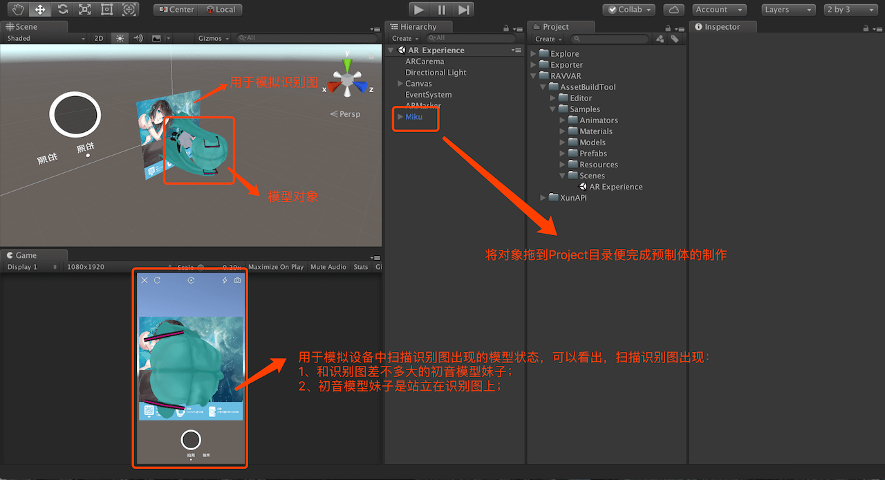
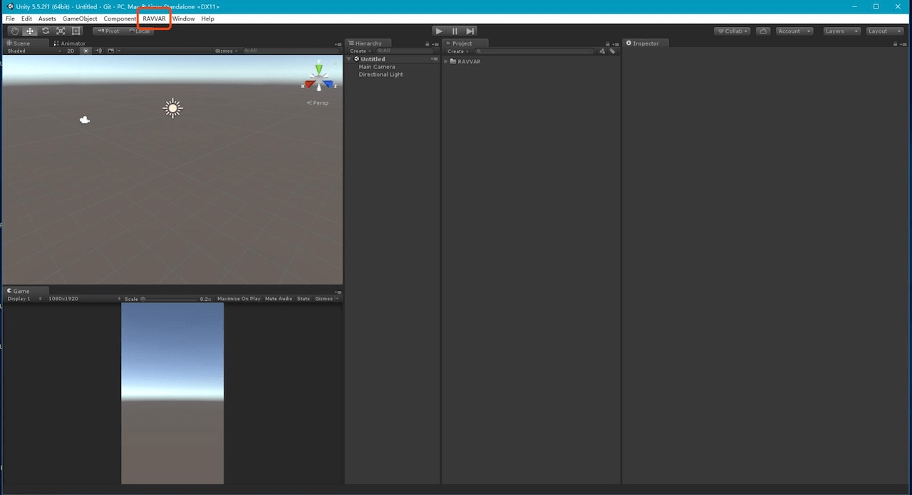
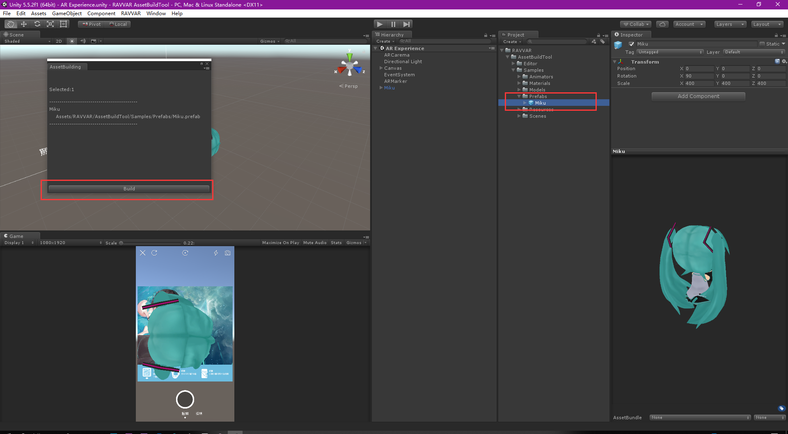
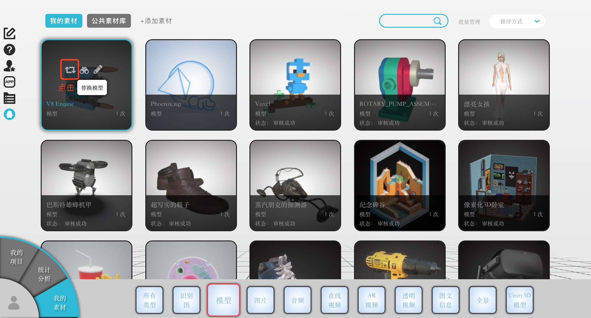
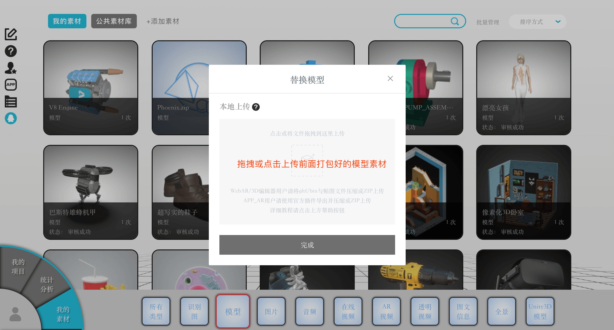

# RAVVAR APP资源打包插件使用教程
## 使用准备
### 1.下载Unity5.5.2

https://unity3d.com/cn/get-unity/download/archive

### 2.下载打包插件

https://github.com/yangfawen/AssetBuildTool-RAVVAR/raw/master/Plugins/RAVVAR-AssetBuildTool_v_1_0_7.unitypackage

## 具体教程
### 1.制作预制体
选择“RAVVAR - AssetBuildTool - Samples - Scenes - AR Experience”，打开参考场景；

 

需要格外注意的是：由于使用了新上传的资源包，并且我们可以随意更改资源包中对象的大小、位置、旋转，因此在AR编辑器中看到的对象的大小、位置、旋转可能与实际不一样。

如果想要调节对象的参数，一般建议固定一方的数值进行调节，可以固定制作的预制体的数值，然后调节AR编辑器中对象的参数；或者固定R编辑器中对象的参数，调节预制体的参数。

### 2.打包预制体
选择已经做好的一个或多个预制体文件，然后点击菜单栏“RAVVAR - Select Prefab”，最后点击“Build”并选择文件夹开始打包

### 3.登陆后台上传资源包
#### 3.1在后台“我的素材”找到之前上传的模型文件，点击替换模型”

#### 3.2添加资源包

经过以上的步骤，RAVVAR APP便会渲染展示新添加的资源包。